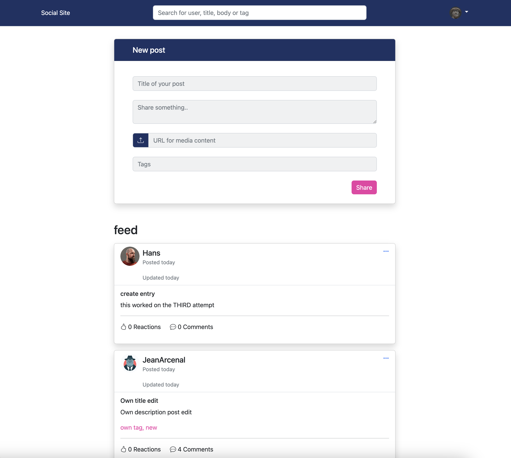

# CSS Frameworks: Course Assignment



## Description

This is a simple project created for a course assignment on CSS Frameworks at Noroff School of Technology and Media. It includes the necessary setup to work with SASS and Bootstrap

## Project Details

- **Project name:** lars-halvor-kallak-css-frameworks-ca
- **Version:** 1.0.0

## Installation

1. Clone the repository

```
git clone https://github.com/lhvk/lars-halvor-kallak-css-frameworks-ca.git
```

2. Install project dependencies using npm or yarn

```
npm install

yarn install
```

## Usage

### Building SASS

To compile SASS files into CSS, you can use the following npm script;

```
npm run build
```

This will compile your SASS files from the `scss`directory into the `css` directory

### Watching for changes

If you want to automatically compile SASS files and have a development server running, you can use the following npm script:

```
npm run watch
```

This will watch for changes in your SASS files and update the CSS, and it will also start a live development server.

## Dependencies

This project uses the following dependencies:

- **Bootstrap:** Version 5.2.3
- **Bootstrap Icons** Version 1.9.1

## Development Dependencies

The development of this project relies on the following dev dependencies:

- **Live Server:** Version 1.2.2
- **SASS:** Version 1.56.1
